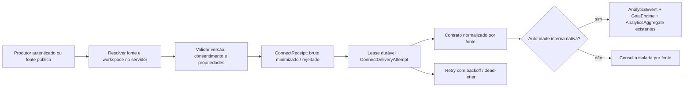

# LinkOr Connect P0 — contrato e operação

O P0 entrega registro de fontes, ingestão e consulta normalizada por fonte, fila
PostgreSQL e integração opcional ao Analytics existente. Não instala conectores de
provedores nem altera automaticamente os coletores públicos existentes.

## Modelo de dados



| Tabela                                       | Responsabilidade                                                                                                                                                                 |
| -------------------------------------------- | -------------------------------------------------------------------------------------------------------------------------------------------------------------------------------- |
| `ConnectSource`                              | Workspace, origem, confiança, eventos permitidos, consentimento, origins, hash da credencial, watermarks e política de projeção.                                                 |
| `ConnectReceipt`                             | Uma chave de idempotência por workspace/fonte/evento, bruto minimizado, estado, normalizado, correlação, lease, prazo, erro e referência de projeção. A própria tabela é a fila. |
| `ConnectDeliveryAttempt`                     | Tentativas numeradas, início/fim e código de falha; chave composta com workspace.                                                                                                |
| `AnalyticsEvent`                             | Histórico preservado; novos campos opcionais registram versão, fonte, tempos, consentimento e reconciliação.                                                                     |
| `AnalyticsAggregate` / `AnalyticsConversion` | Mesmas estruturas e regras existentes, sem novo motor de métricas.                                                                                                               |

As migrations são aditivas. Não fazem backfill, não criam fontes e não inserem eventos
sintéticos. O índice de reconciliação é uma expressão SQL; não o remova com `db push`
por ele não aparecer como `@@unique` no Prisma. A criação do índice pode bloquear
escritas em uma tabela grande: medir tempo e planejar janela antes de produção.

## Contrato v1

O schema executável está em `modules/connect/contract.ts`. Exemplo **ilustrativo** de
payload, a usar somente com eventos reais ou no ambiente isolado de teste:

```json
{
  "event_id": "34e8a86c-c522-45b3-9aaa-0af1939e29a6",
  "event_name": "page_view",
  "event_version": 1,
  "occurred_at": "2026-10-08T12:00:00Z",
  "properties": { "page_category": "landing" },
  "consent_context": {
    "analytics": "granted",
    "policy_version": "2026-10"
  }
}
```

O produtor gera UUID estável por ocorrência e conserva **o mesmo ID e conteúdo** em
retries. A versão é obrigatória. Datas ISO incluem timezone e são normalizadas em UTC.
`event_name` usa o catálogo universal existente; `goal_completed` é exclusivamente
interno. Versões desconhecidas e propriedades extras são rejeitadas.

O servidor acrescenta `workspace_id`, `source_type`, `source_connection_id`,
`received_at` e `processed_at`. Enviá-los no payload causa rejeição, inclusive em
fontes autenticadas. A credencial ou o ID público da fonte resolve o workspace.

`session_id`, `campaign_id` e `asset_id`/`asset_type` só são aceitos de uma fonte
`internal` + `owned_asset`, após verificação de propriedade no banco. Sessões precisam
de consentimento concedido e de visitante no mesmo workspace. Não são criados
visitantes a partir desses eventos. `journey_id` é sempre `null` no v1: não existe
entidade autoritativa que permita validar um ID recebido. Não há junção por IP,
navegador, valor, horário parecido ou inferência probabilística.

| Categoria                                 | Propriedades admitidas                                                                                                             |
| ----------------------------------------- | ---------------------------------------------------------------------------------------------------------------------------------- |
| Eventos terminados em `_view`             | `page_category`: landing, product, profile, other                                                                                  |
| Eventos terminados em `_click` ou `_scan` | `element_type`: link, button, social, qr, form, other                                                                              |
| payment_completed / checkout_completed    | `transaction_id` UUID opcional; `value_minor` inteiro não negativo e `currency` de três letras maiúsculas, obrigatoriamente em par |
| Demais eventos permitidos                 | Objeto vazio                                                                                                                       |

Não se aceita metadata livre, nomes, emails, telefone, URLs, query strings, IP ou
conteúdo de formulários. Não envie identificadores pessoais disfarçados de IDs.
Snapshots de métricas, totais importados e payloads de APIs de provedores precisam
de um futuro adaptador explícito; não são eventos deste contrato.

`consent_context.analytics` admite granted, denied, unknown e not_applicable.
Fontes exigem granted por padrão. Somente configuração operacional de uma fonte
não pública pode dispensar esse requisito, quando existir fundamento adequado;
`denied`, DNT e GPC sempre impedem a entrada na fila. Isso não representa um sistema
de consentimento nem uma revogação retroativa. `policy_version` e `collected_at` são
opcionais, estritos e limitados. Brutos rejeitados conservam apenas ID válido, nome
reconhecido, hash autenticado e motivo; dados inválidos não são copiados para logs.

## APIs e autenticação

| Rota                                                            | Autorização e resultado                                                                        |
| --------------------------------------------------------------- | ---------------------------------------------------------------------------------------------- |
| POST `/api/connect/events`                                      | Bearer da fonte, apenas servidor; rejeita headers de navegação/origin.                         |
| POST/OPTIONS `/api/connect/public/:sourceId`                    | Fonte pública habilitada, Origin exata e consentimento; sem credenciais secretas.              |
| GET `/api/connect/sources`                                      | Sessão Better Auth e participação no workspace; nunca retorna hash/credencial. Até 100 fontes. |
| PATCH `/api/connect/sources/:id`                                | Papel manage + mesma origem; `{ "enabled": false }` pausa ingestão e novos claims.             |
| GET `/api/connect/receipts?source_connection_id=ID&cursor=UUID` | Leitura do workspace, sempre por fonte; 100 registros por página, cursor estável.              |
| GET `/api/connect/health`                                       | Saúde de ingestão por fonte no workspace; até 100 fontes.                                      |
| POST `/api/connect/receipts/:id/replay`                         | Papel manage + mesma origem, apenas dead-letter com bruto não expirado; auditado.              |
| POST `/api/internal/connect`                                    | `CONNECT_WORKER_SECRET`, servidor; operação drain ou retention.                                |
| POST `/api/internal/connect/sources`                            | `CONNECT_ADMIN_SECRET`, servidor; provision ou rotate.                                         |

Ingestão: **202** só após commit da inbox; **200** para duplicata já conhecida;
**409** para mesmo ID com conteúdo diferente; **422** para evento rejeitado;
**400/413/415** para transporte inválido; **401/403** para autenticação/origem;
**429** para limite; **503** + Retry-After para indisponibilidade. Reenvie após 503
com backoff e o mesmo ID. Um 202 não significa processamento ou conversão concluída.
JSON malformado, payload excessivo e requisição não autenticada geram apenas logs
sanitizados, sem receipt de negócio. O limite de 16 KiB é aplicado durante a leitura.

Origens são uma barreira do navegador, não autenticação contra um cliente que forje
headers. Fontes públicas ficam obrigatoriamente isoladas, exigem consentimento e
só aceitam eventos observacionais. Não podem afirmar pagamentos, leads ou conversões.
O rate limit reutiliza a infraestrutura existente; produção falha fechada sem
Upstash configurado. O IP usado pelo limiter não entra no contrato nem associa identidade.

## Idempotência e reconciliação

1. A unique key `(workspaceId, sourceConnectionId, idempotencyKey)` decide concorrência
   na ingestão. Mesmos ID/conteúdo retornam receipt original; conteúdo diferente nunca
   sobrescreve o primeiro recebimento. Rejeição também reserva o ID durante sua retenção.
2. Um hash HMAC do conteúdo normalizado permite comparação sem reter PII rejeitada.
   No P0 a chave é `BETTER_AUTH_SECRET`: sua rotação causa conflitos para retries de
   receipts anteriores. Planejar drain/expiração ou migração explícita de hashes antes
   de rotacioná-la; **não** transformar conflitos em novos IDs para contorná-los.
3. Uma única fonte interna habilitada por workspace pode projetar em Analytics.
   `eventId` nativo é namespaced por workspace. `connectOriginalEventId` guarda o UUID
   lógico; índice único em workspace + COALESCE(original, eventId) arbitra inclusive
   corrida entre escritor legado e Connect. Falha de concorrência volta para retry.
4. Evento legado com mesmo ID precisa corresponder em nome, tempo, ativo, sessão e
   campanha. Divergência gera RECONCILIATION_CONFLICT; correspondência aponta para o
   histórico sem incrementar buckets/Goals. Não repara agregados legados que falharam.
5. Fontes externas permanecem separadas. Mesmo transaction_id em fontes distintas não
   autoriza somá-las nem inferir equivalência. Contagens de estado/recebimento são
   métricas operacionais, não alcance, receita ou conversões de marketing.

O produtor precisa reutilizar o ID da ocorrência nas entradas legado/Connect. IDs
diferentes para o mesmo fato não podem ser deduplicados legitimamente. Não faça dual
instrumentation com novos IDs. A garantia de idempotência depende da retenção; não
há tombstone eterna nem promessa de coleta perfeita.

## Fila, falhas e retenção

O PostgreSQL usa `FOR UPDATE SKIP LOCKED`. Claim, incremento da tentativa e registro
da tentativa são uma transação. Lease de 60 s e token impedem confirmação de um
worker substituído. Projeção, Goals, buckets, normalizado e ack são outra transação
única. Não há intervalo entre gravar evento e confirmar a fila.

Falhas transitórias: até cinco tentativas por ciclo, backoff de 1, 2, 4, 8… segundos
com até 25% de jitter, teto de uma hora. Exaustão vira dead-letter. Crash após claim
consome tentativa e é recuperado após lease. Se persistir a falha de nack, o lease
continua recuperável. Erros permanentes de contrato/propriedade são rejeitados, sem
retry. Replay administrativo abre novo ciclo de cinco tentativas, preservando todo
o histórico e registrando audit. A ordem de chegada não determina ordem de ocorrência.

Atraso máximo: 30 dias; tolerância futura: 5 minutos. Buckets usam occurred_at. O
watermark de fonte é monotônico. A aceitação temporal é avaliada contra received_at,
não contra o horário do retry. Recebimentos não implicam sincronização completa do
provedor, e timestamps de consentimento não constituem prova jurídica de consentimento.

Bruto: 7 dias; rejeitado: 7 dias; demais receipts/normalizados/tentativas: 365 dias.
Bruto expirado deixa de ser processável/reexecutável. Retention marca backlog expirado
como dead-letter e remove o bruto, depois remove receipts vencidos com tentativas em
cascade. Os prazos dependem da execução do job, não de TTL automático do PostgreSQL.
Analytics nativo mantém sua política legada separada (`ANALYTICS_RETENTION_DAYS`);
o job Connect não apaga histórico legado nem seus agregados. Não mudar o horizonte de
retenção sem rever as garantias de replay/idempotência e obrigações de privacidade.

## Provisionamento e ativação

1. Em staging, aplicar `npm run prisma:deploy` com a URL correta. Validar permissões,
   custo/tempo do índice e backup conforme operação do banco. Nenhuma migration foi
   aplicada em produção por esta implementação.
2. Usar uma role de runtime **sem SUPERUSER/BYPASSRLS**. As três tabelas Connect têm
   ENABLE/FORCE RLS, filtros e chaves estrangeiras compostas. Sessões do servidor
   definem `app.workspace_id` com `SET LOCAL` após validar membership; o worker usa
   `app.connect_worker=on`. Não conceder acesso SQL a clientes: variáveis de sessão
   são contexto de confiança do servidor, não credenciais autônomas. RLS não foi
   retroativamente implementada nas tabelas legadas.
3. Configurar `CONNECT_ADMIN_SECRET` e `CONNECT_WORKER_SECRET` distintos, aleatórios,
   com pelo menos 32 caracteres, e o rate limiter distribuído. Nunca prefixar com
   NEXT_PUBLIC nem incluir em bundles, links, logs ou respostas de APIs de sessão.
4. Criar JSON operacional, por exemplo:

```json
{
  "operation": "provision",
  "workspace_id": "WORKSPACE_EXISTENTE",
  "source": {
    "key": "site-principal",
    "type": "external_site",
    "trust": "public",
    "allowedOrigins": ["https://seu-site.example"],
    "allowedEvents": ["page_view", "button_click"],
    "requiresConsent": true,
    "projection": "isolated"
  }
}
```

Executar `node scripts/connect-source.mjs config.json /diretorio-privado/source.json`
com CONNECT_BASE_URL e CONNECT_ADMIN_SECRET no ambiente seguro. O arquivo é criado
com modo 0600, fora do checkout, sem sobrescrever arquivo existente; a credencial
não é impressa. Para fontes de servidor, usar type conversion_api/connector e trust
authenticated. Para a autoridade própria, owned_asset/internal/native. Entregar o
segredo somente ao backend responsável. Rotação usa operação rotate com workspace_id

- source_connection_id e invalida imediatamente a credencial anterior.

5. Agendar POST autenticado ao worker ao menos a cada minuto, body
   `{ "operation": "drain", "limit": 10 }`; agendar retention diariamente. Invocações
   concorrentes são suportadas. Ajustar frequência/capacidade a partir da idade da
   fila. Um request processa lote limitado, não drena backlog ilimitado. O repositório
   não provisiona um scheduler e não considera o job ativo sem validação operacional.
6. Validar dados reais de uma fonte controlada em staging: accepted → normalized →
   consulta, consentimento negado, duplicate, indisponibilidade, retry e DLQ. Testar
   source pause e rotação. Ativar tráfego gradualmente, observando os indicadores.
   Os coletores antigos continuam ativos e não migram para a inbox automaticamente.

## Saúde e observabilidade

Logs JSON `component=linkor_connect`, metric, timestamp, correlationId, workspaceId,
sourceConnectionId, receiptId, tentativa, código e duração quando disponíveis. Sem
payloads, credenciais ou stack/raw error do banco. Enviar estes logs ao coletor já
usado na infraestrutura; este P0 não instala um observability provider.

Health por fonte: queued/processing/normalized/rejected/dead-letter, recebimentos
24 h, duplicatas/conflitos dos receipts recebidos nas últimas 24 h, tentativas por
resultado em 24 h, idade do item pendente mais antigo, p95 de lag de processamento,
último recebimento/processamento e watermark de ocorrência. Duplicatas/conflitos
são contadores acumulados desses receipts, não uma série temporal de entregas.

Alertar para dead-letter > 0, idade pendente > 300 s, retry/rejeição, fonte sem tráfego
além de expectedIntervalSeconds, 503/429 e ausência de execução do scheduler. Não
configurar intervalo esperado para fontes que legitimamente ficam ociosas. As
consultas são limitadas a 100 fontes; particionar a operação antes de ultrapassar
esse limite. `upstreamSyncStatus=unknown`: não há cursor/checkpoint de provedor nem
indicador de completude de sincronização neste P0.

## Verificação reproduzível

- `npm test`: unidade/regressão; integração PostgreSQL é explicitamente ignorada.
- `npm run test:connect`: exige TEST_DATABASE_URL separada, terminada em `_test`,
  aplica migrations somente nela, executa cenários PostgreSQL e remove fixtures.
  O teste de RLS cria temporariamente uma role NOLOGIN em transação; a credencial do
  banco de teste precisa poder criar role. Não usar credencial de produção.
- `npm run lint`, `npm run typecheck`, `npm run build`.

Não executar testes simultaneamente com `prisma generate`/build: a regeneração do
cliente modifica módulos no disco e pode produzir falhas transitórias de importação.
O relatório de liberação registra resultados e limitações em `verification.md`.
